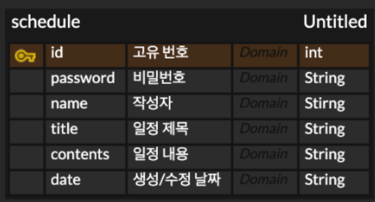

# Schedule

### API 명세서
| 기능       | Method | URL                     | request | response | 상태코드                     |
|----------|--------|-------------------------|---------|----------|--------------------------|
| 일정 생성    | POST   | /schedule               | 요청 body | 등록 정보    | 201 Created, 400 실패      |
| 전체 일정 조회 | GET    | /schedule               |         | 다건 응답 정보 | 200 정상 조회, 400 실패        |
| 선택 일정 조회 | GET    | /schedule/{schedule_id} |         | 단건 응답 정보 | 200 정상 조회, 404 Not Found |
| 선택 일정 수정 | PATCH  | /schedule/{schedule_id} | 요청 body | 수정 정보    | 200 정상 수정, 404 Not Found |
| 선택 일정 삭제 | DELETE | /schedule/{schedule_id} | 요청 body |          | 200 정상 삭제, 404 Not Found |


#### 1. 일정 생성
/calendar
+ Request
  + Header : Content-Type:application/json
  + Body :

```
{
    "name": "작성자",
    "password": "비밀번호",
    "title": "제목",
    "contents": "내용"
}
```

  | 이름       | 타입     | 설명    | 필수 | 
  |----------|--------|-------|----|
  | name     | String | 작성자명  | O  |
  | password | String | 비밀번호  | O  |
  | title    | String | 일정 제목 | O  |
  | contents | String | 일정 내용 | X  |

+ Response
  + Body :

```
{
    "schedule_id": "아이디",
    "name": "작성자",
    "title": "제목",
    "createdDate": "YYYY-MM-DD HH:mm:ss",
    "updatedDate": "YYYY-MM-DD HH:mm:ss"
}
```
  
  | 이름          | 타입     | 설명      |
  |-------------|--------|---------|
  | schedule_id | int    | 일정 고유번호 |
  | name        | String | 작성자명    |
  | title       | String | 일정 제목   |      
  | createdDate | String | 생성 일시   |   
  | updatedDate | String | 수정 일시   |   


#### 2. 전체 일정 조회
/calendar
+ Request
  + Parameters :
  
  | 이름          | 타입     | 설명        | 필수 | 
  |-------------|--------|-----------|----|
  | name        | String | 작성자명      | X  |      
  | createdDate | String | 조회할 생성 일자 | X  |      


+ Response
  + Body :

```
[
  {
      "schedule_id": "아이디",
      "name": "작성자",
      "title": "제목",
      "createdDate": "YYYY-MM-DD HH:mm:ss",
      "updatedDate": "YYYY-MM-DD HH:mm:ss"
      
  },
  {
      "id": "아이디",
      "name": "작성자",
      "title": "제목",
      "createdDate": "YYYY-MM-DD HH:mm:ss",
      "updatedDate": "YYYY-MM-DD HH:mm:ss"
      
  }
]
```
  
  | 이름          | 타입     | 설명      |
  |-------------|--------|---------|
  | schedule_id | int    | 일정 고유번호 |
  | title       | String | 일정 제목   |
  | name        | String | 작성자명    |
  | createdDate | String | 생성 일자   |
  | updatedDate | String | 수정 일시   |


#### 3. 선택 일정 조회
/calendar/{schedule_id}

+ Request

+ Response
  + Body :

```
{
    "name": "작성자",
    "title": "제목",
    "contents": "내용",
    "createdDate": "YYYY-MM-DD HH:mm:ss",
    "updatedDate": "YYYY-MM-DD HH:mm:ss"
}
```

  | 이름          | 타입     | 설명    |
  |-------------|--------|-------|
  | name        | String | 작성자명  |
  | title       | String | 일정 제목 |
  | contents    | String | 일정 내용 |
  | createdDate | String | 생성 일시 |
  | updatedDate | String | 수정 일시 |


#### 4. 선택 일정 수정
/calendar/{schedule_id}

+ Request
  + Parameters :
  
  | 이름       | 타입     | 설명     | 필수 | 
  |----------|--------|--------|----|
  | name     | String | 작성자명   | X  |      
  | password | String | 비밀번호   | O  |      
  | title    | String | 수정할 제목 | X  |      
  | contents | String | 수정할 내용 | X  |      


+ Response
  + Body :

```
{
    "name": "작성자",
    "title": "제목",
    "contents": "내용",
    "createdDate": "YYYY-MM-DD HH:mm:ss",
    "updatedDate": "YYYY-MM-DD HH:mm:ss"
}
```

  | 이름          | 타입     | 설명    |
  |-------------|--------|-------|
  | name        | String | 작성자명  |
  | title       | String | 일정 제목 |
  | contents    | String | 일정 내용 |
  | createdDate | String | 생성 일시 |
  | updatedDate | String | 수정 일시 |

#### 5. 선택 일정 삭제
/calendar/{schedule_id}

+ Request
  + Parameters :

  | 이름          | 타입     | 설명        | 필수 | 
  |-------------|--------|-----------|----|
  | password    | String | 비밀번호      | O  |      

+ Response
  + Body :

```
schedule_id번 일정이 삭제되었습니다
```

### ERD
# schedule
